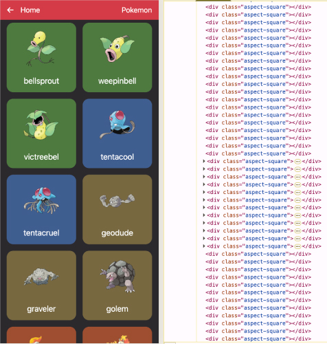
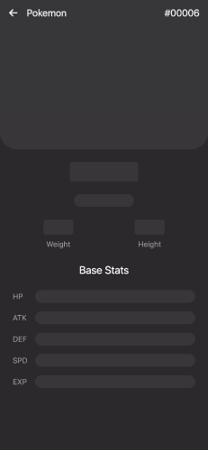
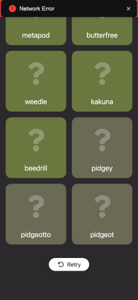

# 我進行的效能與體驗優化項目

- [無限滾動渲染優化](#無限滾動渲染優化)
- [避免重複 API 請求](#避免重複-api-請求)
- [Skeleton loading 提升體感](#skeleton-loading-提升體感)
- [錯誤處理與重試機制](#錯誤處理與重試機制)

---

## 無限滾動渲染優化

在大量資料渲染的無限滾動設計中，若不加控制，將造成 DOM 元素爆量，影響效能。

> ✅ 解法：透過 `IntersectionObserver` 偵測元件是否進入視窗範圍，僅渲染可視區域的元件內容，提升效能並降低記憶體消耗。

---

## 避免重複 API 請求

### Pokemon Detail 頁面資料快取

Pokemon 的 List API 不含圖片，需額外呼叫每筆 Detail API；Digimon 則無此問題。

| 資料來源 | 是否含圖片 |
|----------|------------|
| Pokemon  | ❌         |
| Digimon  | ✅         |

> ✅ 解法：在 `/pokemon` 頁面載入時預先快取 Detail 資料至 React Context，點擊進入 `/pokemon/:id` 詳細頁時先檢查快取，避免重複請求。

### Detail 返回 List 頁面，維持狀態

從 Detail 返回 List 頁面時，若重新請求 List API 並重置捲動位置，將影響使用體驗。

> ✅ 解法：在 List 頁面時將資料與 scroll position 快取至 Context，返回時恢復原狀，無需重新請求。

---

## Skeleton loading 提升體感

API 載入時間不可避免，若畫面完全空白將造成使用者困惑。

> ✅ 解法：導入 Skeleton UI，在資料未到前提供佔位視覺，提升使用者感知效能與信任感。

---

## 錯誤處理與重試機制

API 請求可能因網路或伺服器問題失敗。

> ✅ 解法：統一處理錯誤回應，顯示清楚錯誤訊息並提供「重試」按鈕，避免中斷操作流程。

