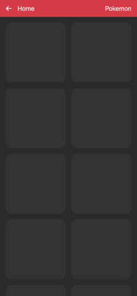
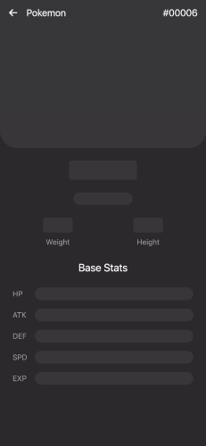

# 我進行的效能與體驗優化項目

- [無限滾動渲染優化](#無限滾動渲染優化)
- [避免重複 API 請求](#避免重複-api-請求)
- [Skeleton loading 提升體感](#skeleton-loading-提升體感)
- [錯誤處理與重試機制](#錯誤處理與重試機制)

---

## 無限滾動渲染優化

在大量資料渲染的無限滾動設計中，若不加控制，將造成 DOM 元素爆量，影響效能。

> ✅ 解法：透過 `IntersectionObserver` 偵測元件是否進入視窗範圍，僅渲染可視區域的元件內容，提升效能並降低記憶體消耗。

---

## 避免重複 API 請求

因爲有大量角色的資料請求，且使用者會經常切換頁面，若不加控制，將造成大量重複請求與效能問題。

> ✅ 解法：導入 React Query，將暫存 API 請求的邏輯與狀態，避免重複請求與狀態錯誤。

---

## Skeleton loading 提升體感

API 載入時間不可避免，若畫面完全空白將造成使用者困惑。

> ✅ 解法：導入 Skeleton UI，在資料未到前提供佔位視覺，提升使用者感知效能與信任感。

---

## 錯誤處理與重試機制

API 請求可能因網路或伺服器問題失敗。

> ✅ 解法：請求錯誤統一處理，顯示吐司訊息；頁面載入錯誤提示錯誤重試按鈕；網路離線顯示提示訊息。

